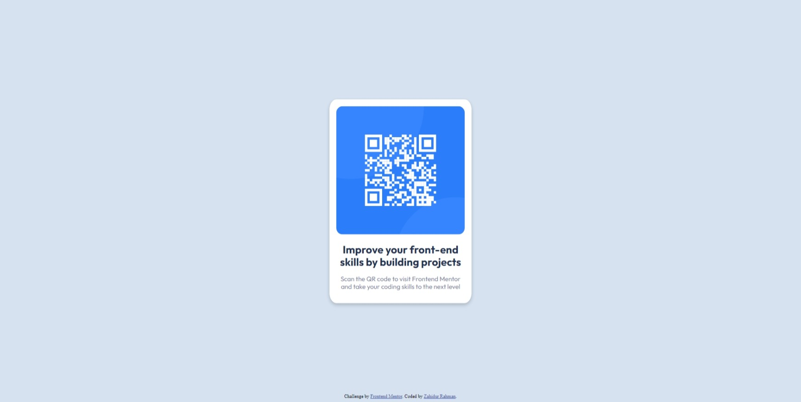

# Frontend Mentor - QR code component solution

This is a solution to the [QR code component challenge on Frontend Mentor](https://www.frontendmentor.io/challenges/qr-code-component-iux_sIO_H). Frontend Mentor challenges help you improve your coding skills by building realistic projects. 

## Table of contents

- [Overview](#overview)
  - [Screenshot](#screenshot)
  - [Links](#links)
- [My process](#my-process)
  - [Built with](#built-with)
  - [What I learned](#what-i-learned)
  - [Useful resources](#useful-resources)
- [Author](#author)

## Overview

### Screenshot



### Links

- Solution URL: [Add solution URL here](https://your-solution-url.com)
- Live Site URL: [Add live site URL here](https://your-live-site-url.com)

## My process

### Built with

- HTML
- CSS
- Flexbox

### What I learned

Through this project I learned the basic positioning items. Like I positioned the entrie card in the middle of the website which I did with absolute positioning. Here is the code below.

```css
.card {
      position: absolute;
      top: 50%;
      left: 50%;
      transform: translate(-50%, -50%);
}
```

Also, I learned something new by adding the footer to the bottom of the website. And I did that with this code. It will make your footer element at the bottom of your webpage.
First you have to make your body element to flex.

```css
body {
      min-height: 100vh;
      display: flex;
      flex-direction: column;
    }
```

Then add this code to your footer element.

```css
.attribution { margin-top: auto; }
```

Lastly I learned how to put shadows to an element. Like I added a simple shadow to the card. Here is the code:

```css
.card {
      box-shadow: 0 4px 8px 0 rgba(0,0,0,0.2);
    }
```

### Useful resources

- [Example resource 1](https://www.w3schools.com/howto/howto_css_cards.asp) - This helped me for creating my card. It helped me with the idea and with the shadows.
- [Example resource 2](https://chat.openai.com/) - This is chatGPT. If you don't know it's an AI chatbot that will help you with anything. An assistant you can call. But be sure it's not perfect yet.

## Author

- Website - [Zahidur Rahman](https://github.com/ZahidurRahman8759)